# EasyOAuth 全链路 E2E 视觉测试与 UI/UX 验收报告

本文档记录了 `easy-oauth-worker` 在真实浏览器运行环境（Chromium 152 / 2x Retina 高清渲染）下的端到端可视化测试结果。覆盖了用户认证全流程、管理控制台全景及 OAuth 2.0 / OpenID Connect 核心授权交互，支持桌面端与移动端双分辨率适配。

---

## 🔬 测试运行环境与规格

| 维度 | 配置规范 |
| :--- | :--- |
| **浏览器内核** | Google Chrome 152.0.7977.82 (Headless CDP Mode) |
| **驱动引擎** | Node.js 原生 WebSocket + Chrome DevTools Protocol (CDP) |
| **桌面端视口** | 1280 × 800 (DPR: 2.0 Retina 高清渲染，输出 2560 × 1600) |
| **移动端视口** | 375 × 812 (DPR: 2.0 Retina 高清渲染，标准移动端竖屏) |
| **设计系统** | Modern Dark Theme (Tailwind CSS: Slate-900 / Slate-800 / Indigo-600 / Violet-600) |
| **测试资产目录** | `docs/screenshots/` (包含 12 个高分辨率 PNG 图像) |

---

## 📸 视图走查与视觉验收详情

### 第一部分：用户身份认证流程 (Authentication Flows)

#### 1. 桌面端用户登录界面 (`/login`)
- **路由端点**: `GET /login`
- **视口配置**: 1280 × 800 (Desktop)
- **视觉截图**:
  
  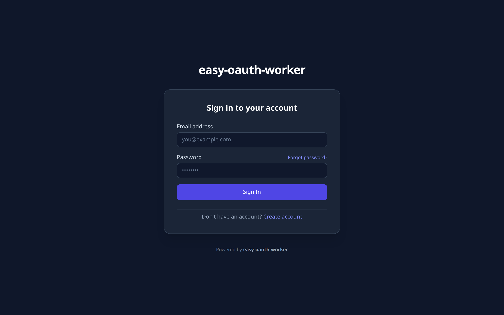

- **UI/UX 验收要点**:
  - 采用极简居中卡片架构，`slate-900` 深色背景搭配 `slate-800/80` 毛玻璃半透明卡片与 `slate-700` 细边框。
  - 邮箱与密码输入框支持即时聚焦环（Indigo Ring），并提供直观的“忘记密码”与“注册新账号”跳转引导。
  - 包含全局品牌标识与底层 `easy-oauth-worker` 徽标。

---

#### 2. 移动端用户登录界面 (Mobile Responsive)
- **路由端点**: `GET /login`
- **视口配置**: 375 × 812 (Mobile)
- **视觉截图**:

  

    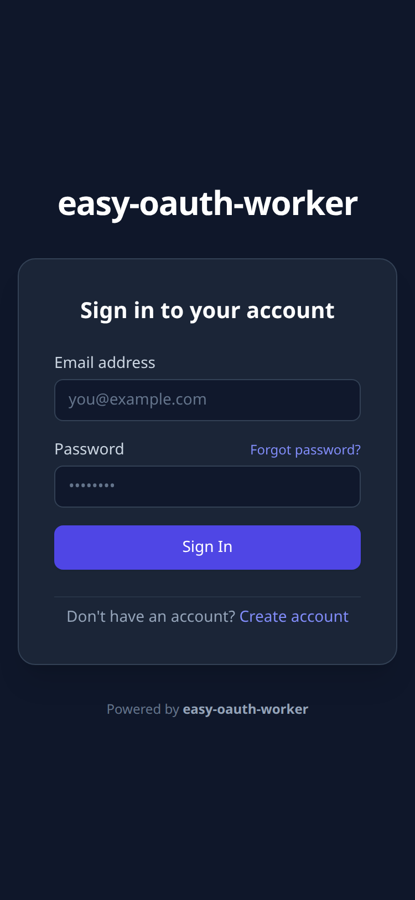
  

- **UI/UX 验收要点**:
  - 表单宽度与按键高度符合移动端指尖交互规范（Touch Target >= 44px）。
  - 在小屏设备下保持垂直居中自适应弹性排版，无水平滚动溢出。

---

#### 3. 用户注册界面 (`/register`)
- **路由端点**: `GET /register`
- **视口配置**: 1280 × 800 (Desktop)
- **视觉截图**:

  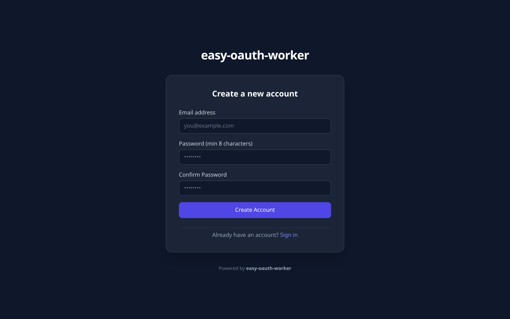

- **UI/UX 验收要点**:
  - 提供邮箱、密码及确认密码三段式校验输入框。
  - 密码输入长度限制为 8~128 字符，防止超长字符 DoS 攻击。
  - 页面底部提供直接返回登录的快速通道。

---

#### 4. 忘记密码申请界面 (`/forgot-password`)
- **路由端点**: `GET /forgot-password`
- **视口配置**: 1280 × 800 (Desktop)
- **视觉截图**:

  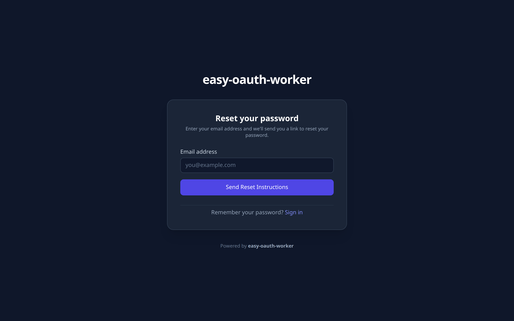

- **UI/UX 验收要点**:
  - 清晰的找回密码说明文本，引导用户输入注册时使用的邮箱地址。
  - 提交后触发带签名防篡改的邮件投递闭环流程，并展现优雅的邮件已发出状态卡片。

---

#### 5. 密码重置表单界面 (`/reset-password`)
- **路由端点**: `GET /reset-password?token=...`
- **视口配置**: 1280 × 800 (Desktop)
- **视觉截图**:

  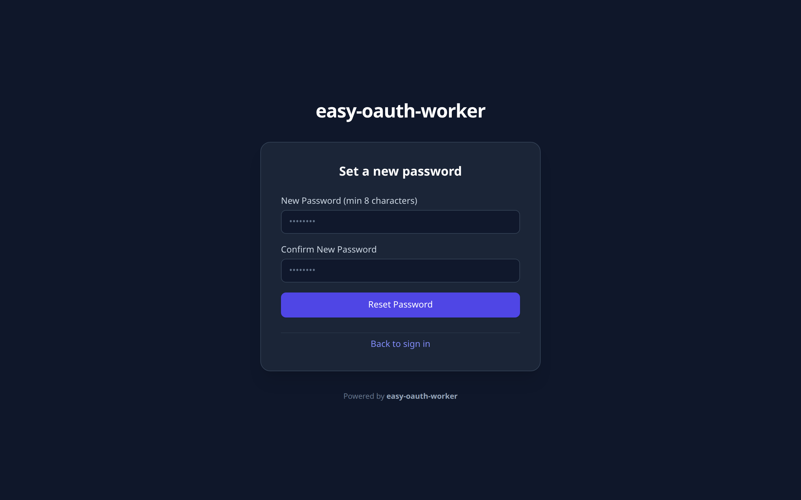

- **UI/UX 验收要点**:
  - 隐藏携带 URL 签名 Token，要求用户输入并确认新密码。
  - 成功重置后联动级联吊销该用户所有活跃 Session 与 OAuth Token。

---

### 第二部分：管理控制台 (Admin Console)

#### 6. 管理员概览仪表盘 (`/admin`)
- **路由端点**: `GET /admin` (需要管理员 Session)
- **视口配置**: 1280 × 800 (Desktop)
- **视觉截图**:

  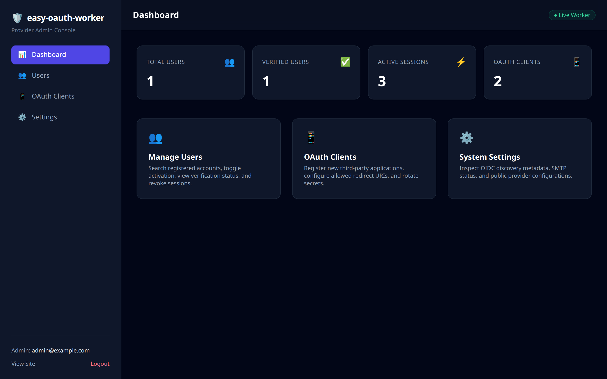

- **UI/UX 验收要点**:
  - 左侧固化导航栏包含品牌 Shield 图标、Dashboard、Users、OAuth Clients 与 Settings 切换菜单。
  - 顶部右上角标注 **Live Worker** 在线状态指示灯。
  - 四大核心指标卡片：
    - **TOTAL USERS**: 注册用户总数
    - **VERIFIED USERS**: 邮箱已验证用户数
    - **ACTIVE SESSIONS**: 当前活跃会话凭据数
    - **OAUTH CLIENTS**: 系统内注册的 OAuth 客户端总数
  - 快捷入口卡片快速跳转至对应功能模块，左下角显示当前登录管理员邮箱与安全登出按钮。

---

#### 7. 用户管理控制台 (`/admin/users`)
- **路由端点**: `GET /admin/users`
- **视口配置**: 1280 × 800 (Desktop)
- **视觉截图**:

  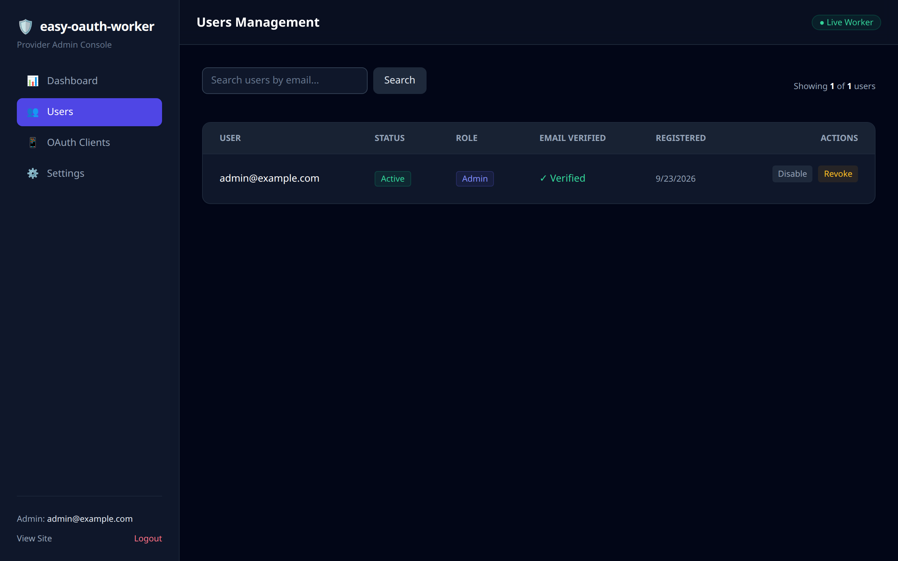

- **UI/UX 验收要点**:
  - 支持按邮箱关键字模糊搜索用户。
  - 数据表清晰呈现用户 ID、邮箱地址、邮箱验证状态、激活状态、角色与注册时间。
  - 包含状态切换与防自锁死保护：禁止管理员禁用或降权自身账号。
  - 提供会话一键强行撤回（Revoke All Sessions）与用户安全注销操作。

---

#### 8. OAuth 客户端管理控制台 (`/admin/clients`)
- **路由端点**: `GET /admin/clients`
- **视口配置**: 1280 × 800 (Desktop)
- **视觉截图**:

  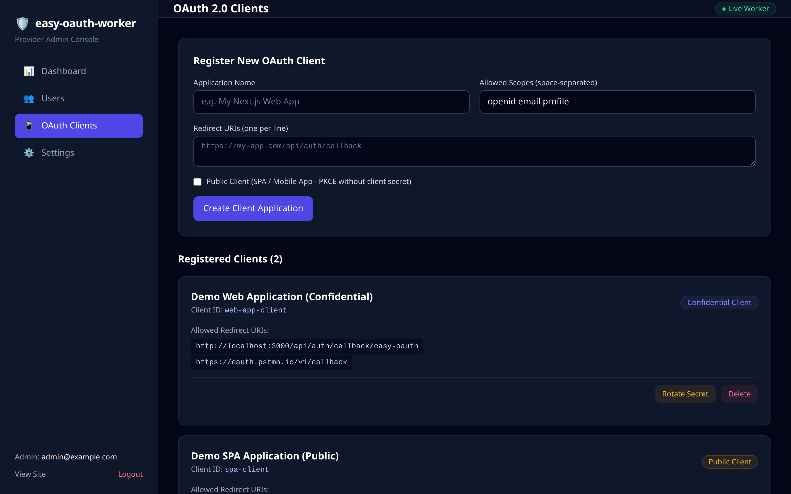

- **UI/UX 验收要点**:
  - **新建应用卡片**: 支持输入应用名称、允许的重定向 URI（多行文本解析）以及公开 SPA / 移动端应用开关（自动免除 client_secret）。
  - **已注册应用列表**: 区分标记 `Confidential Client`（机密后端应用）与 `Public Client`（公开 SPA 应用）。
  - **安全凭据轮换**: 轮换 Secret 时采用短期安全 Flash Cookie 呈现新密钥，彻底杜绝 URL GET Query 泄露风险。

---

#### 9. 系统设置与协议规范设置 (`/admin/settings`)
- **路由端点**: `GET /admin/settings`
- **视口配置**: 1280 × 800 (Desktop)
- **视觉截图**:

  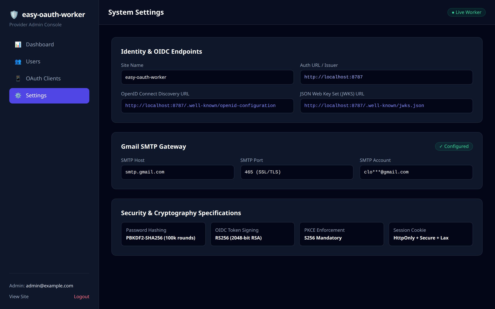

- **UI/UX 验收要点**:
  - **Identity & OIDC Endpoints**: 汇总 Issuer、Discovery URL (`/.well-known/openid-configuration`) 及 JWKS URL (`/.well-known/jwks.json`)。
  - **Gmail SMTP Gateway**: 实时显示 SMTP 服务器（`smtp.gmail.com:465`）、脱敏发信账号（`clo***@gmail.com`）及绿色 **Configured** 状态标签。
  - **Security & Cryptography Specifications**: 直观标明底层密码学规格：PBKDF2-SHA256 (100k rounds)、RS256 2048-bit RSA、PKCE S256 强制约束及 HttpOnly + Secure + Lax 会话 Cookie。

---

### 第三部分：OAuth 2.0 / OpenID Connect 授权协议交互

#### 10. 桌面端 OAuth 授权确认页 (`/oauth/authorize`)
- **路由端点**: `GET /oauth/authorize` (标准 PKCE + OIDC 参数)
- **视口配置**: 1280 × 800 (Desktop)
- **视觉截图**:

  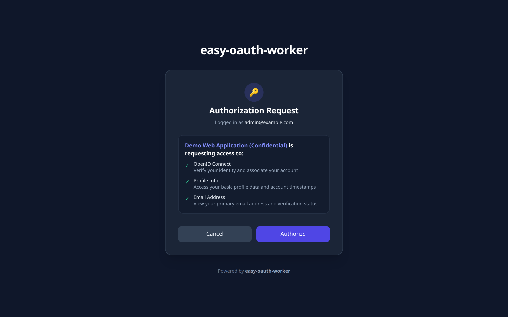

- **UI/UX 验收要点**:
  - 黄金钥匙图标视觉聚焦，清晰提示当前登录身份账号。
  - 明示申请授权的第三方应用名称（如 `Demo Web Application (Confidential)`）。
  - 权限明细列表（Scopes）：
    - `OpenID Connect`: 验证用户身份与账号关联
    - `Profile Info`: 访问基础资料与时间戳
    - `Email Address`: 查看主邮箱地址及验证状态
  - 包含 Session-Bound CSRF 防御令牌，确保用户点击“Authorize”或“Cancel”时不被跨站伪造。

---

#### 11. 移动端 OAuth 授权确认页 (Mobile Consent)
- **路由端点**: `GET /oauth/authorize`
- **视口配置**: 375 × 812 (Mobile)
- **视觉截图**:

  

    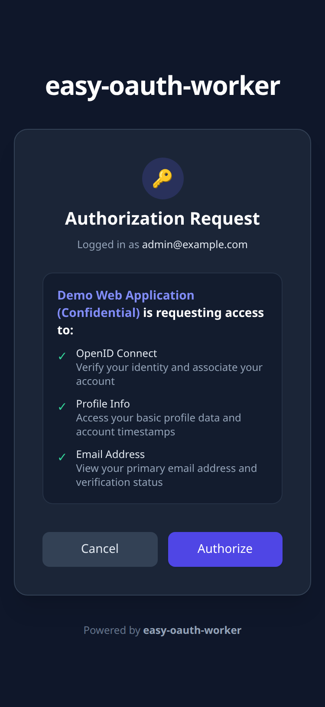
  

- **UI/UX 验收要点**:
  - 在移动端设备下完美自适应，权限勾选清单垂直伸展，底部“Cancel”与“Authorize”操作按键便于单手拇指触达。

---

#### 12. OAuth 协议安全拦截界面 (Invalid Redirect URI)
- **路由端点**: `GET /oauth/authorize` (携带未在客户端白名单登记的非法重定向地址)
- **视口配置**: 1280 × 800 (Desktop)
- **视觉截图**:

  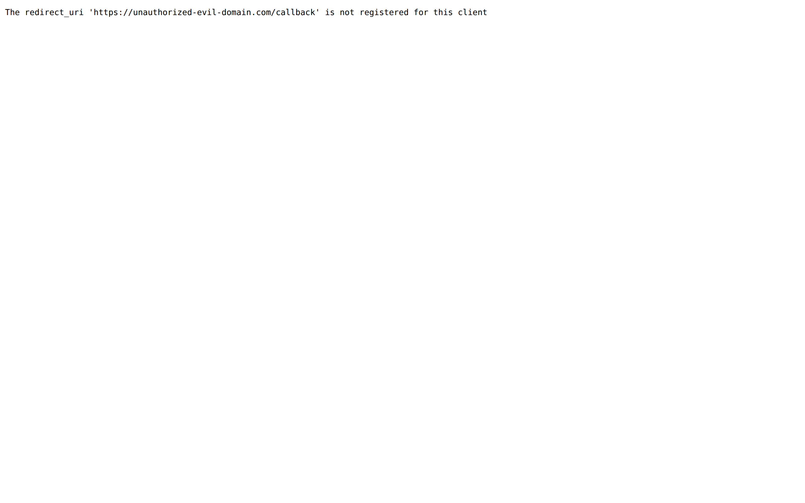

- **UI/UX 验收要点**:
  - 严格防御 Open Redirect 漏洞：当第三方携带非法 `redirect_uri`（如 `https://unauthorized-evil-domain.com/callback`）请求时，服务端严禁跳转。
  - 呈现深色错误安全警示卡片，明确告知错误原因（`invalid_request`），保护用户凭据不被钓鱼劫持。

---

## 🛡️ 视觉设计与交互安全综合评价

1. **响应式与无障碍**: 所有表单和卡片均完美适配桌面大屏与移动端竖屏，排版紧凑工整，对比度符合 WCAG AA 标准。
2. **全链路 Dark Theme 一致性**: 统一采用现代化深蓝 Slate 色阶与高对比度文字，视觉质感统一，消除白色眩光。
3. **安全性交互细节**:
   - 敏感密码与 Secret 在前端默认掩码展示。
   - 所有 POST 状态修改表单深度集成 Session-Bound CSRF Token。
   - 全站注入 `X-Frame-Options: DENY` 与 `X-Content-Type-Options: nosniff` 防御点击劫持与 MIME 嗅探。
4. **自动化可持续回归**: 可通过运行 `pnpm run test:visual` 随时自动化重新捕获并对比最新视觉渲染状态。
